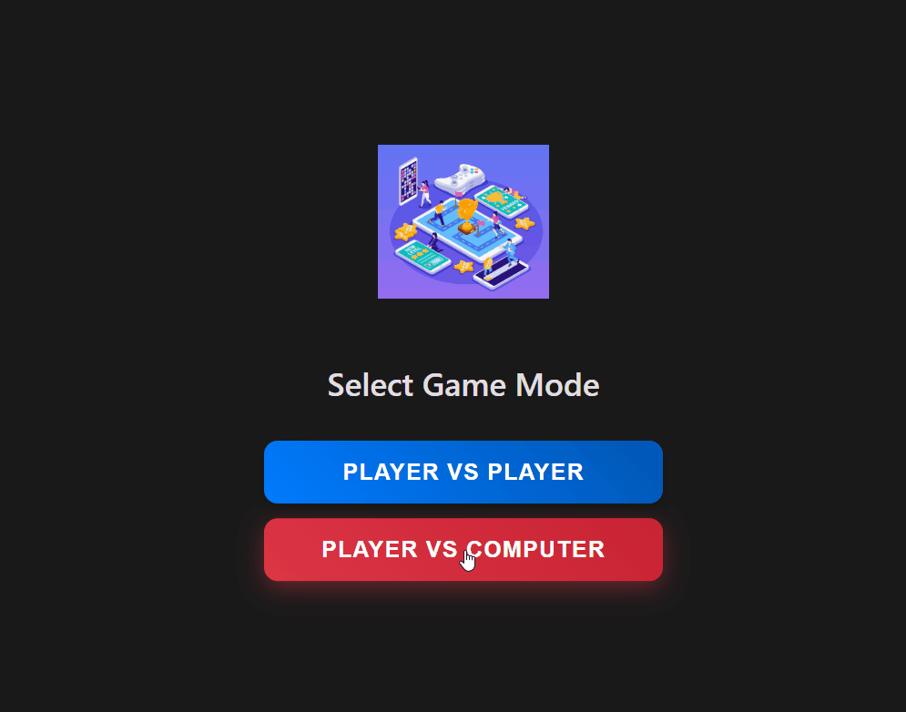

# Tic Tac Toe - React Project

## Overview

This project is a classic implementation of the Tic Tac Toe game, developed using **React JS**. It showcases fundamental front-end development principles and my ability to build interactive web applications, now with a new **vs Computer** mode.

## Key Features

- Dynamic game state management.
- Component-based UI design for the game board and squares.
- Logic to determine winning conditions and game progression.
- Ability to reset the game.
- **Play against a simple AI in the vs Computer mode.**

## Gameplay



## Technologies Used

- React JS
- JavaScript
- HTML
- CSS

## What This Project Demonstrates

- **Front-end Development:** Building user interfaces with a modern JavaScript library.
- **React JS Proficiency:** Understanding and applying core React concepts like components, state, and props.
- **State Management:** Effectively managing application state for game logic.
- **UI Development:** Creating an interactive and responsive user interface.
- **Problem-Solving:** Implementing game logic for both player-vs-player and player-vs-computer modes.

## How to Run This Project Locally

1.  **Clone the repository:**
    ```bash
    git clone [https://github.com/JonIsAwayy/react-tic-tac-toe.git](https://github.com/JonIsAwayy/react-tic-tac-toe.git)
    ```
2.  **Navigate to the project directory:**
    ```bash
    cd react-tic-tac-toe
    ```
3.  **Install dependencies:**
    ```bash
    npm install
    # or yarn install
    ```
4.  **Start the development server:**
    ```bash
    npm run dev
    # or yarn dev
    ```
    - This will usually open the app in your browser at `http://localhost:5173` (or a similar port).
